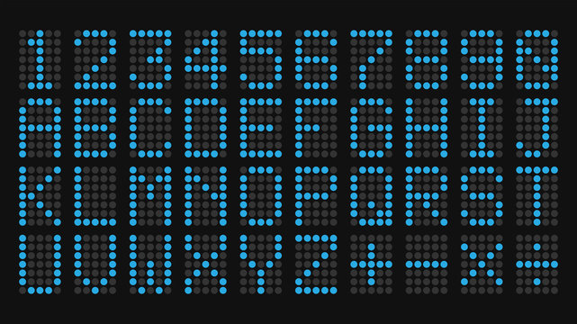

# Interactive LED Matrix with Auto Control

##  Project Idea
An interactive LED Matrix game controlled by a push button (digital input) and a sound sensor (analog input).  
You can turn the matrix ON or OFF with a long press, show a random emoji with a single press, or display an emoji based on sound intensity with a double press.

## Components
- Arduino UNO  
- MAX7219 4-in-1 LED Matrix  
- Push Button (digital input)  
- KY-038 Sound Sensor (analog input)  
- Breadboard  
- Jumper Wires (Male-to-Male & Male-to-Female)  

## What is an LED Matrix?
An **LED Matrix** is a grid of LEDs arranged in rows and columns, allowing you to display text, numbers, symbols, and animations by controlling individual LEDs.  
In this project, we use a **MAX7219 4-in-1** module (32x8 pixels) for creating interactive visual displays.


###  1. Installing the LedControl Library
1. Open **Arduino IDE**.  
2. Go to `Sketch` → `Include Library` → `Manage Libraries...`.  
3. Search for **LedControl** and install it (by Eberhard Fahle).  
4. Add to your code:  
   ```cpp
   #include <LedControl.h>

###  2. Creating LED Matrix Patterns
- Use the online tool [LED Matrix Editor](https://xantorohara.github.io/led-matrix-editor/) to draw your design.  
- Copy the generated hex values and paste them into your Arduino code as a byte array.

#### Example Patterns
Here are some example patterns that include shapes, letters, and signs.
  
