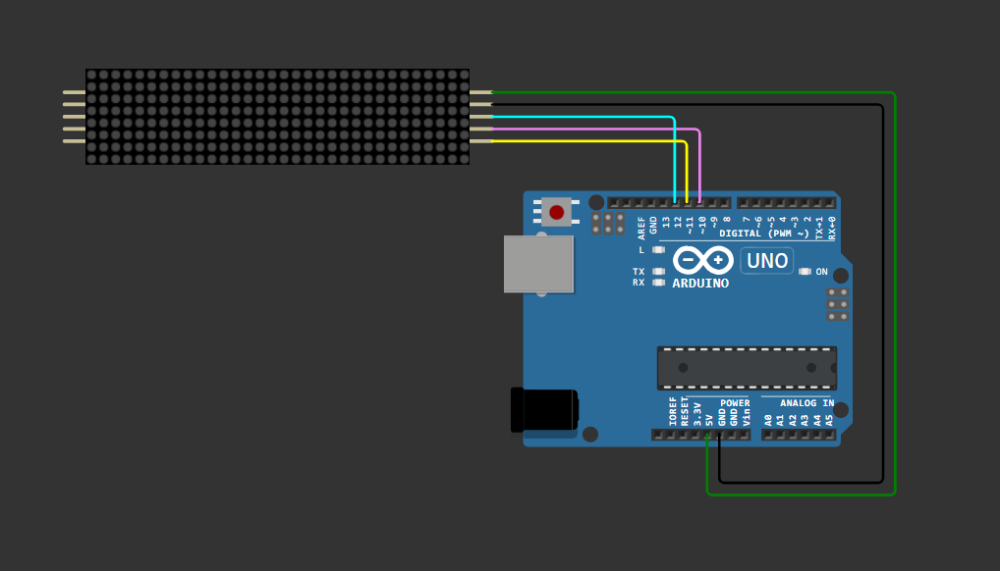
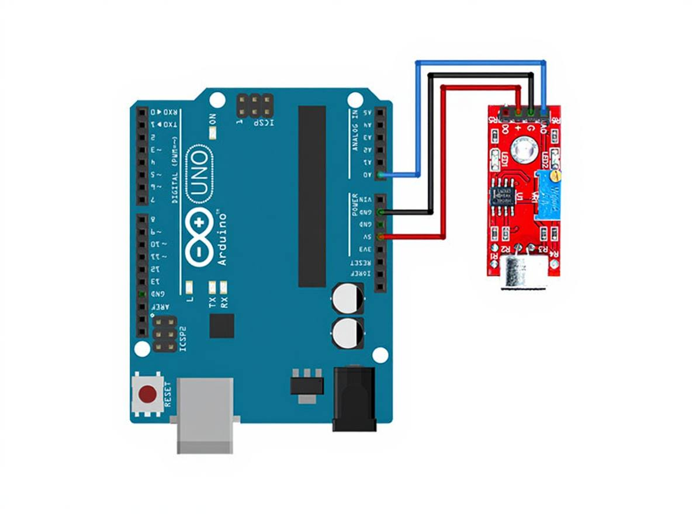
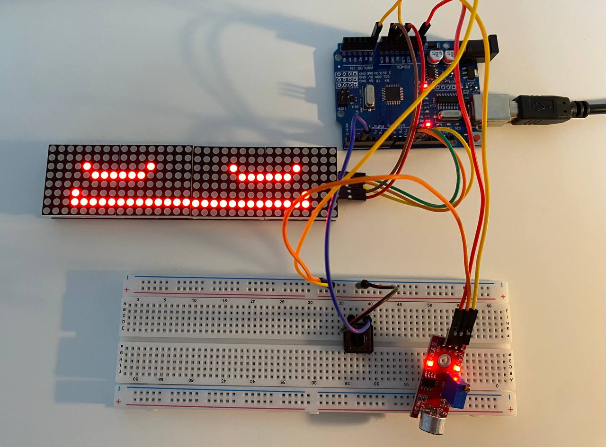

# Interactive LED Matrix with Auto Control

##  Project Idea
An interactive LED Matrix game controlled by a push button (digital input) and a sound sensor (analog input).  
You can turn the matrix ON or OFF with a long press, show a random emoji with a single press, or display an emoji based on sound intensity with a double press.

## Components
- Arduino UNO  
- MAX7219 4-in-1 LED Matrix  
- Push Button (digital input)  
- KY-038 Sound Sensor (analog input)  
- Breadboard  
- Jumper Wires (Male-to-Male & Male-to-Female)  

## What is an LED Matrix?
An **LED Matrix** is a grid of LEDs arranged in rows and columns, allowing you to display text, numbers, symbols, and animations by controlling individual LEDs.  
In this project, we use a **MAX7219 4-in-1** module (32x8 pixels) for creating interactive visual displays.


###  1. Installing the LedControl Library
1. Open **Arduino IDE**.  
2. Go to `Sketch` → `Include Library` → `Manage Libraries...`.  
3. Search for **LedControl** and install it (by Eberhard Fahle).  
4. Add to your code:  
   ```cpp
   #include <LedControl.h>

###  2. Creating LED Matrix Patterns
- Use the online tool [LED Matrix Editor](https://xantorohara.github.io/led-matrix-editor/) to draw your design.  
- Copy the generated hex values and paste them into your Arduino code as a byte array.

#### Example Patterns
Here are some example patterns that include digit, letters, and signs.
  

### 3. Wiring the LED Matrix to Arduino UNO
| MAX7219 Pin | Arduino UNO Pin |
|-------------|-----------------|
| VCC         | 5V              |
| GND         | GND             |
| DIN         | D12             |
| CS          | D10             |
| CLK         | D11             |




## What is a Sound Sensor?
KY-038 is a simple microphone module. In this project we use the **analog output (AO)** to measure sound intensity (0–1023).  
> Note: The **DO** pin is digital (HIGH/LOW with an internal comparator). We **don’t** use it here.

#### Wiring (KY-038 → Arduino UNO)
| KY-038 Pin | Arduino Pin |
|------------|-------------|
| VCC        | 5V          |
| GND        | GND         |
| AO         | A0          |



## Full Circuit Wiring 

| Component                | Pin on Component | Arduino UNO Pin |
|--------------------------|------------------|-----------------|
| **MAX7219 LED Matrix**   | VCC              | 5V              |
|                          | GND              | GND             |
|                          | DIN              | D12             |
|                          | CS               | D10             |
|                          | CLK              | D11             |
| **KY-038 Sound Sensor**  | VCC              | 5V              |
|                          | GND              | GND             |
|                          | AO               | A0              |
| **Push Button**          | Pin 1            | D2              |
|                          | Pin 2            | GND             |



## Demo – How the Game Works
The demo below shows how the game operates using the LED Matrix, push button, and sound sensor.  

- Long press → Turns the matrix ON or OFF.  
- Single press → Displays a random emoji.  
- Double press → Measures sound intensity for 3 seconds, then shows an emoji based on the detected sound level.  

<video src="https://private-user-images.githubusercontent.com/210694101/476314605-b5b09143-0f1c-4906-9263-9fd13f65f98b.MP4?jwt=eyJ0eXAiOiJKV1QiLCJhbGciOiJIUzI1NiJ9.eyJpc3MiOiJnaXRodWIuY29tIiwiYXVkIjoicmF3LmdpdGh1YnVzZXJjb250ZW50LmNvbSIsImtleSI6ImtleTUiLCJleHAiOjE3NTQ3NzY3NTIsIm5iZiI6MTc1NDc3NjQ1MiwicGF0aCI6Ii8yMTA2OTQxMDEvNDc2MzE0NjA1LWI1YjA5MTQzLTBmMWMtNDkwNi05MjYzLTlmZDEzZjY1Zjk4Yi5NUDQ_WC1BbXotQWxnb3JpdGhtPUFXUzQtSE1BQy1TSEEyNTYmWC1BbXotQ3JlZGVudGlhbD1BS0lBVkNPRFlMU0E1M1BRSzRaQSUyRjIwMjUwODA5JTJGdXMtZWFzdC0xJTJGczMlMkZhd3M0X3JlcXVlc3QmWC1BbXotRGF0ZT0yMDI1MDgwOVQyMTU0MTJaJlgtQW16LUV4cGlyZXM9MzAwJlgtQW16LVNpZ25hdHVyZT03MjdkNmM2ZmRmNTg2YzAzOGIzY2NlMDZjZWZiZDc5NzdhNjRjYjM0MzkzMGY4MjE2ZTE5Y2M5M2RlYjRkNGFjJlgtQW16LVNpZ25lZEhlYWRlcnM9aG9zdCJ9.zMcAvRDgTBqH3yuPC6rl29IBljWQnVQG7Tek-roj4FY" controls></video>
